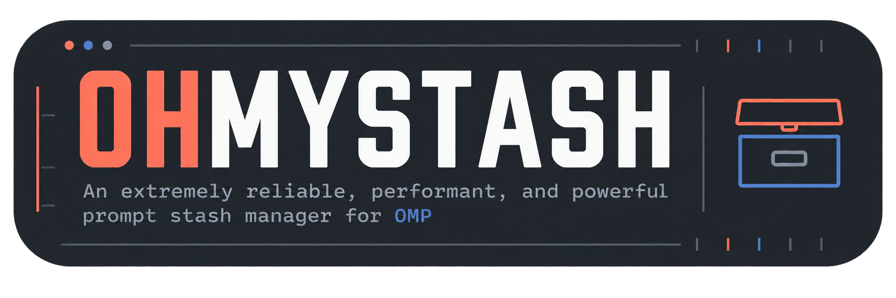
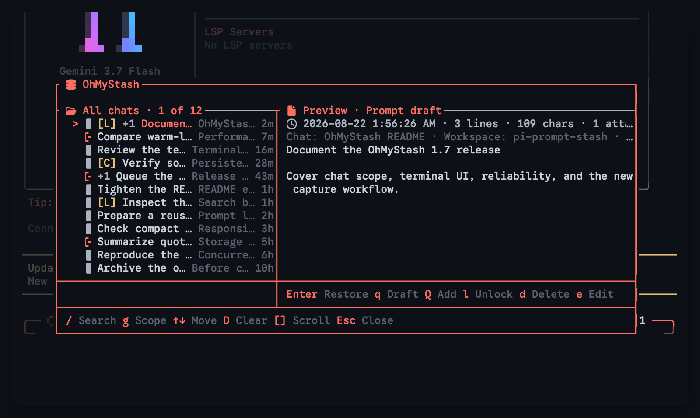
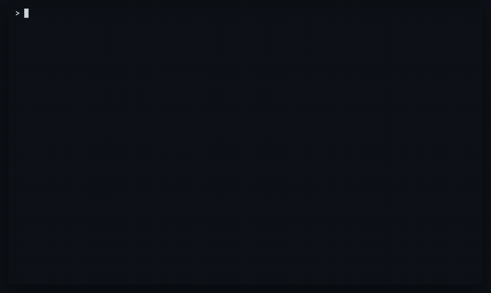
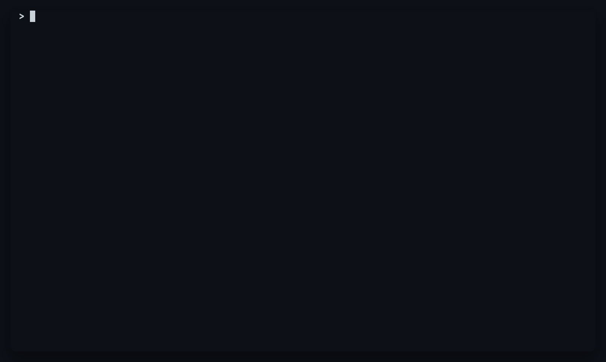
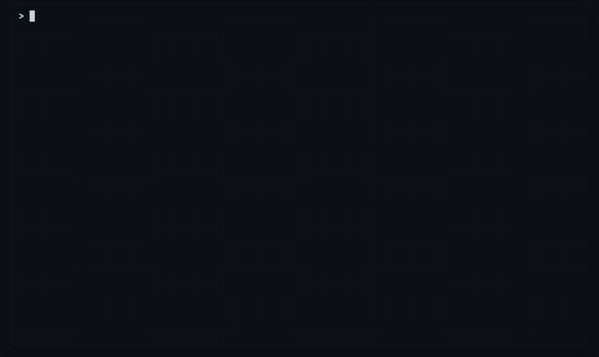
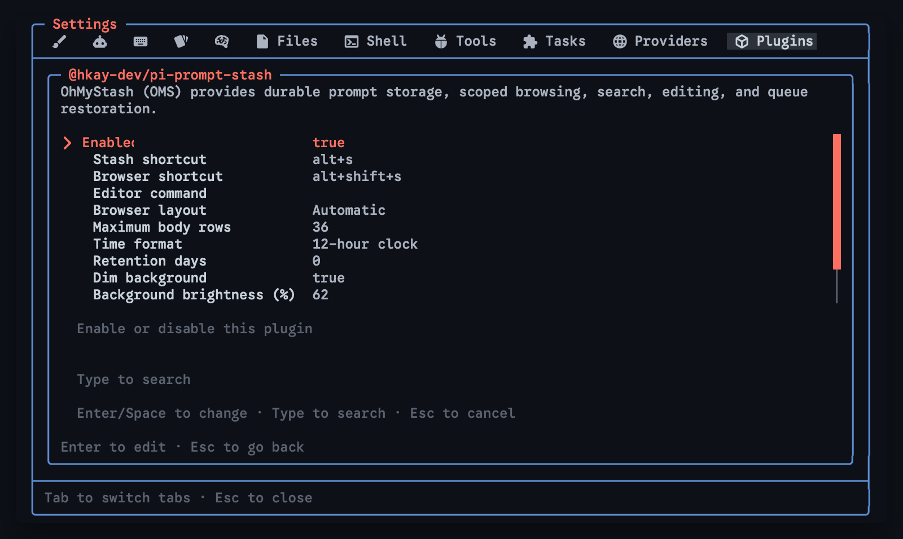

<p align="center">
  
</p>

# OhMyStash for Oh My Pi

OhMyStash (OMS) stores unfinished OMP prompts without submitting them. It preserves normal and `/queue` drafts, images, collapsed large pastes, timestamps, source-chat metadata, and locks.

## Two ways to use OMS

### `Alt+S`: stash and restore one prompt

Press `Alt+S` while the composer contains a prompt to stash it immediately. The composer clears so you can move to something else.

Press `Alt+S` on an empty composer to restore the newest stash from the current chat. The stash remains saved after restoration.

### `Alt+Shift+S`: open the browser

Press `Alt+Shift+S` to open the full stash browser. The browser supports preview, search, chat scope, queue actions, editing, locking, and deletion.



Considerable work went into the browser's visual hierarchy, color treatment, spacing, and keyboard flow.

## Browser capabilities

- **Chat scope.** Open on stashes from the current chat and press `g` to switch to all chats.
- **Source metadata.** Global entries show the source chat, workspace, timestamp, and short session ID.
- **Search.** Filter prompt text, chat names, workspaces, timestamps, queue mode, locks, and attachments.
- **Queue draft.** Press `q` to place the selected stash in the composer as an editable `/queue` draft.
- **Submit queue.** Press `Shift+Q` to prepend `/queue ` and submit the selected stash while keeping the browser open for more.
- **Attachments.** Restore images and collapsed large pastes with the prompt that owns them.
- **Editing.** Press `e` to edit a stash with the configured editor or OMP's built-in editor.
- **Locking.** Lock reusable stashes so deletion leaves them alone.
- **Scoped deletion.** Delete one unlocked stash or clear unlocked stashes from the current browser scope.

## Feature recordings

### Current chat and all chats

The browser starts on the current chat. Pressing `g` switches to all chats, back to the current chat, and back to all chats again.



### Queue draft

Regular `q` comes first. It puts the stash into the composer as an editable `/queue` draft.


### Submit queue

`Shift+Q` prepends `/queue `, submits the stash immediately, and keeps the browser open. Repeat it to stack messages in OMP's queue, then press `Esc` to exit.


### Search

Search narrows the current scope as you type.



### Attachments

Images and large pasted bodies return with their stash.



### Editing

Search for a stash, select it, and press `e` to edit it.


### Locking and deletion

Locked stashes remain protected during bulk deletion.


## Controls

| Action | Default control |
| --- | --- |
| Stash the composer, or restore the newest stash from this chat when empty | `Alt+S` |
| Open the stash browser | `Alt+Shift+S` |
| Open the browser from the composer | `/stash` |
| Restore the newest stash from this chat | `/stash restore` |
| Switch between This chat and All chats | `g` |
| Start fuzzy search | `/` |
| Keep the current filter selected | `Tab` |
| Restore the selected stash | `Enter` |
| Insert an editable queue draft | `q` |
| Prepend `/queue ` and submit the selected stash | `Shift+Q` |
| Edit the selected stash | `e` |
| Lock or unlock the selected stash | `l` |
| Delete the selected unlocked stash | `d` or `Delete` |
| Delete every unlocked stash in the active scope | `Shift+D` |
| Scroll the preview | `[` / `]` |
| Clear search or close | `Esc` |

## Settings

Open `/settings`, choose **Plugins**, select `@hkay-dev/pi-prompt-stash`, and press `Enter`.



Available settings:

- **Stash shortcut** and **Browser shortcut**, with `none` to disable either one
- **Editor command**, blank to use `$VISUAL`, `$EDITOR`, or OMP's built-in editor
- **Browser layout**: Automatic, Side by side, Stacked, or Compact
- **Maximum body rows**
- **Time format**: 12-hour or 24-hour
- **Retention days**: `0` keeps stashes indefinitely
- **Dim background**
- **Background brightness (%)**
- **Background saturation (%)**
- **Show icons**

Retention removes only expired, unlocked, normal stashes. Locked stashes, conflict copies, and recovery entries do not expire.

The same settings are available from the CLI:

```sh
omp plugin config list @hkay-dev/pi-prompt-stash
omp plugin config set @hkay-dev/pi-prompt-stash "Browser layout" "Stacked"
omp plugin config set @hkay-dev/pi-prompt-stash "Retention days" 30
omp plugin config set @hkay-dev/pi-prompt-stash "Editor command" "code --wait"
omp plugin config set @hkay-dev/pi-prompt-stash "Dim background" false
omp plugin config delete @hkay-dev/pi-prompt-stash "Browser layout"
```

OMS reloads plugin settings when a new OMP session starts.

## Install

OMP's plugin manager uses Bun for package installation:

```sh
brew install bun
```

Install OhMyStash directly from GitHub:

```sh
omp plugin install github:hkay-dev/OhMyStash
```

Restart OMP, then open the browser with `Alt+Shift+S` or `/stash`.

To update OhMyStash after a new release:

```sh
omp plugin install --force github:hkay-dev/OhMyStash
```

Check the installed package and extension manifest with:

```sh
omp plugin doctor @hkay-dev/pi-prompt-stash
```

The display name is OhMyStash. The package ID and configuration key remain `@hkay-dev/pi-prompt-stash`. Existing extension and storage paths do not change.

## Reliability

I treated failed saves and missing stashes as bugs. OMS uses private atomic writes, file and directory fsync, attachment hashes, recoverable crash-window files, conflict copies, lock protection, and strict file checks.

The regression suite covers interrupted writes, concurrent saves and edits, corrupted attachments, symlinks, permissions, quota contention, recovery files, scoped deletion, source metadata, and retention.

## Performance

I treated noticeable delay after a keypress as a bug. Safety checks stay enabled while OMS avoids repeated parsing, lowercasing, preview construction, attachment writes, and rendering work.

Representative medians:

| Operation | Median |
| --- | ---: |
| Plain stash save | 0.249 ms |
| Warm load, 100 entries | 0.995 ms |
| Literal search | 0.00121 ms |
| Fuzzy search | 0.0824 ms |
| Unique 1 MiB attachment write | 1.036 ms |
| Verified 1 MiB attachment reuse | 0.901 ms |
| Verified 1 MiB attachment read | 0.372 ms |
| 1 MiB preview build | 1.315 ms |
| Preview-page extraction | 0.747 ms |
| 1,000 ANSI transformations | 0.226 ms |

Cross-chat benchmark medians:

| Operation | 50 stashes / 10 chats | 256 stashes / 16 chats |
| --- | ---: | ---: |
| Cold load | 2.874 ms | 7.571 ms |
| Warm load | 0.763 ms | 4.150 ms |
| Scope toggle and render | 0.048 ms | 0.045 ms |
| Global literal search and render | 0.086 ms | 0.134 ms |
| Global fuzzy search and render | 0.631 ms | 3.570 ms |
| Split render | 0.016 ms | 0.025 ms |
| Stacked render | 0.015 ms | 0.018 ms |
| Compact render | 0.005 ms | 0.007 ms |

## Storage and limits

Stash files:

```text
~/.omp/agent/prompt-stash/
```

Attachments:

```text
~/.omp/agent/prompt-stash/attachments/
```

Limits:

- 1 MiB inline prompt text
- 64 MiB file-backed prompt body or individual attachment
- 128 MiB total attachments per stash
- 64 attachments per stash
- 2 MiB serialized stash metadata
- 256 normal active stashes
- 16 MiB normal metadata budget

Conflict copies and complete recovery files load outside the normal count and metadata caps. Attachments remain content-addressed for recovery and deduplication.

A separate filesystem backup is still required for hardware failure, filesystem corruption, or machine loss.

## Development

```sh
bun install
bun run check
bun test
bun run benchmark:cross-chat
bun run capture:all
```

OhMyStash targets OMP 17.4 or newer. The extension entry point remains `extensions/prompt-stash.ts`.

## Credits

Terminal recordings were captured programmatically with [tcut](https://github.com/AmanVarshney01/tcut).
