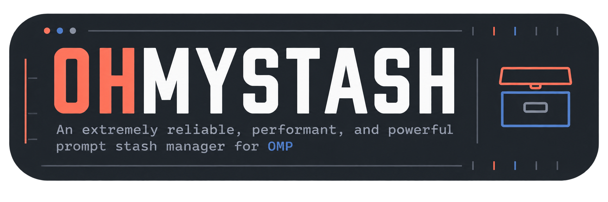
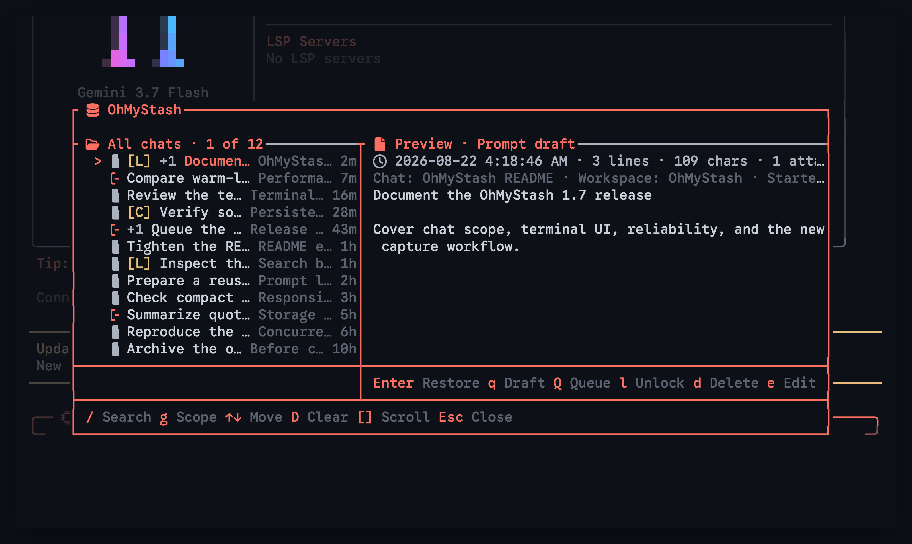
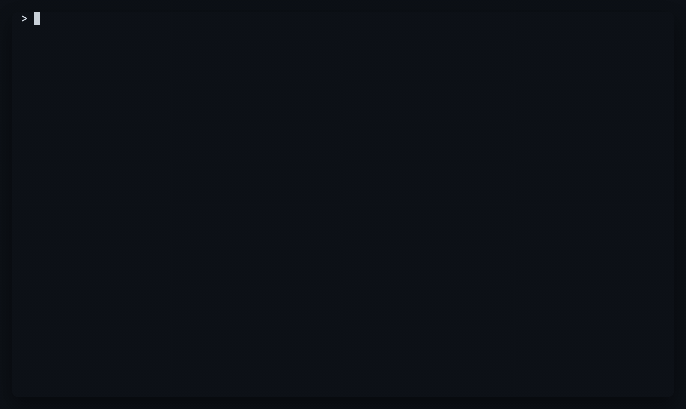
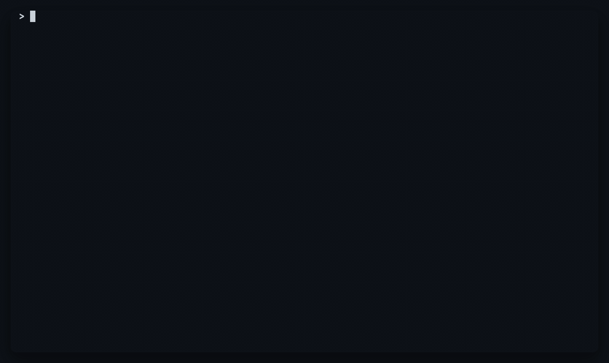
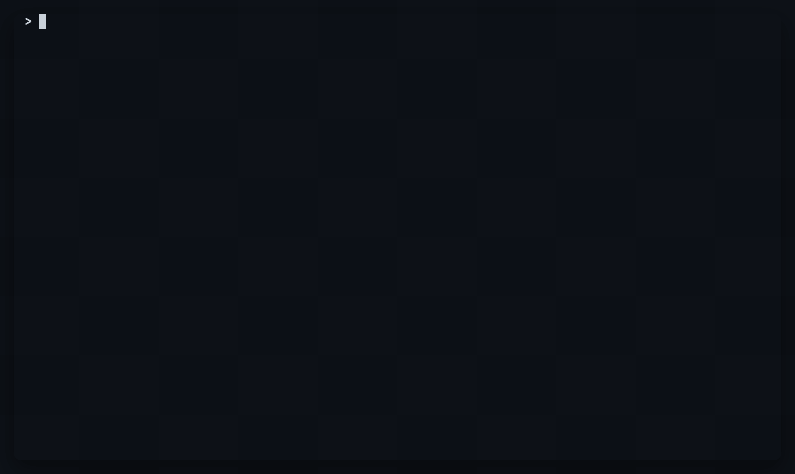
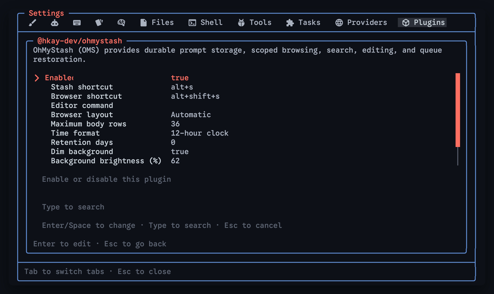

<p align="center">
  
</p>

# OhMyStash for Oh My Pi

I'm proud to present OhMyStash! OMS stores unfinished OhMyPi prompts without submitting them. It preserves normal and `/queue` drafts, images, collapsed large pastes, timestamps, source-chat metadata, locks, and a whole lot more!



I had a ton of fun making this, and I hope you find it just as useful as I do!

## Install

OMP's plugin manager uses Bun for package installation:

```sh
brew install bun
```

Version 1.10.2 works with stock OMP 18.8.3. The browser and option pickers open inline at the bottom, in the composer area, like OMP's built-in Switch Model dialog. They keep square, accent-colored frames without dimming, desaturation, or a full-screen blackout.

Install directly from GitHub:

```sh
omp plugin install github:hkay-dev/OhMyStash
```

OMP installs the standard SDK dependencies automatically. No custom OMP executable, SDK archives, or separate installer is needed. To pin this release, use `github:hkay-dev/OhMyStash#v1.10.2` instead.

Restart OMP, then open the browser with `Alt+Shift+S` or `/stash`.

The image attachment helper uses the stock TUI package's `prompt/image-format` export.

To update an existing installation:

```sh
omp plugin install --force github:hkay-dev/OhMyStash
```

Check the installed package and extension manifest with:

```sh
omp plugin doctor @hkay-dev/ohmystash
```

OMP uses the package ID `@hkay-dev/ohmystash` for plugin settings and diagnostics. Existing stash storage paths do not change.

## Primary Usage

### `Alt+S`: stash and restore one prompt

Press `Alt+S` while the composer contains a prompt to stash it immediately. The composer clears so you can move to something else.

Press `Alt+S` on an empty composer to restore the newest stash from the current chat. The stash remains saved after restoration.

### `Alt+Shift+S`: open the browser

Press `Alt+Shift+S` to open the full stash browser. The browser supports preview, search, chat scope, queue actions, editing, locking, and deletion.

Considerable work went into the browser's visual hierarchy, color treatment, spacing, and keyboard flow.

The browser uses the bottom-docked inline editor area, with square, accent-colored borders and an embedded title. Closing it restores the composer and its attachments. Contextual Nerd Font glyphs honor **Show icons** without changing OMP's global symbol preset. Use a Nerd Font or symbols fallback to display them. This shared frame does not replace the browser's mature search, chat scope, queue, attachment, edit, lock, recovery, retention, or adaptive-layout behavior.

## Browser capabilities

You can do quite a bit more in the browser: 

- **Chat scope.** Open stashes from the current chat and press `g` to switch to all chats.
- **Source metadata.** Global entries show the source chat, workspace, timestamp, and short session ID.
- **Search.** Filter prompt text, chat names, workspaces, timestamps, queue mode, locks, and attachments.
- **Queue draft.** Press `q` to place the selected stash in the composer as an editable `/queue` draft.
- **Submit queue.** Press `Shift+Q` to prepend `/queue ` and submit the selected stash while keeping the browser open for more.
- **Attachments.** Restore images and collapsed large pastes with the prompt that owns them.
- **Editing.** Press `e` to edit a stash with the configured editor or OMP's built-in editor.
- **Locking.** Lock reusable stashes so deletion leaves them alone.
- **Scoped deletion.** Delete one unlocked stash or clear unlocked stashes from the current browser scope.

## More Features!

### Current chat and all chats

The browser starts on the current chat. Pressing `g` switches to all chats, back to the current chat, and back to all chats again.



### Queue draft

Regular `q` comes first. It puts the stash into the composer as an editable `/queue` draft.


### Submit queue

`Shift+Q` prepends `/queue `, submits the stash immediately, and keeps the browser open. Repeat it to stack messages in OMP's queue, then press `Esc` to exit.

Stash or clear any draft in the composer before restoring or submitting a saved prompt. This includes drafts that contain only images.


### Search

Search narrows the current scope as you type.



### Attachments

Images and large pasted bodies return with their stash.



### Editing

Search for a stash, select it, and press `e` to edit it.


### Locking and deletion

Locked stashes remain protected during bulk deletion.


## Controls

| Action | Default control |
| --- | --- |
| Stash the composer, or restore the newest stash from this chat when empty | `Alt+S` |
| Open the stash browser | `Alt+Shift+S` |
| Open the browser from the composer | `/stash` |
| Restore the newest stash from this chat | `/stash restore` |
| Switch between This chat and All chats | `g` |
| Start fuzzy search | `/` |
| Keep the current filter selected | `Tab` |
| Restore the selected stash | `Enter` |
| Insert an editable queue draft | `q` |
| Prepend `/queue ` and submit the selected stash | `Shift+Q` |
| Edit the selected stash | `e` |
| Lock or unlock the selected stash | `l` |
| Delete the selected unlocked stash | `d` or `Delete` |
| Delete every unlocked stash in the active scope | `Shift+D` |
| Scroll the preview | `[` / `]` |
| Clear search or close | `Esc` |

## Settings

Open `/settings`, choose **Plugins**, select `@hkay-dev/ohmystash`, and press `Enter`.



Available settings:

- **Stash shortcut** and **Browser shortcut**, with `none` to disable either one
- **Editor command**, blank to use `$VISUAL`, `$EDITOR`, or OMP's built-in editor
- **Browser layout**: Automatic, Side by side, Stacked, or Compact
- **Maximum body rows**
- **Time format**: 12-hour or 24-hour
- **Retention days**: `0` keeps stashes indefinitely
- **Show icons**, controlling contextual Nerd Font glyphs in the stash browser

Retention removes only expired, unlocked, normal stashes. Locked stashes, conflict copies, and recovery entries do not expire.

Pickers use stock OMP's inline editor area. Conversation history stays in place and keeps its colors; no popup backdrop settings are needed. OMP restores the composer when a picker closes. `/settings` → **Plugins** retains OMP's native settings chrome.

All the same settings are available from the CLI:

```sh
omp plugin config list @hkay-dev/ohmystash
omp plugin config set @hkay-dev/ohmystash "Browser layout" "Stacked"
omp plugin config set @hkay-dev/ohmystash "Retention days" 30
omp plugin config set @hkay-dev/ohmystash "Editor command" "code --wait"
omp plugin config delete @hkay-dev/ohmystash "Browser layout"
```

OMS reloads plugin settings when a new OMP session starts.

## Reliability

I treated failed saves and missing stashes as bugs. OMS uses private atomic writes, file and directory fsync, attachment hashes, recoverable crash-window files, conflict copies, lock protection, and strict file checks.

The regression suite covers interrupted writes, concurrent saves and edits, corrupted attachments, symlinks, permissions, quota contention, recovery files, scoped deletion, source metadata, and retention.

## Performance

I treated noticeable delay after a keypress as a bug. Safety checks stay enabled while OMS avoids repeated parsing, lowercasing, preview construction, attachment writes, and rendering work.

Representative medians:

| Operation | Median |
| --- | ---: |
| Plain stash save | 0.249 ms |
| Warm load, 100 entries | 0.995 ms |
| Literal search | 0.00121 ms |
| Fuzzy search | 0.0824 ms |
| Unique 1 MiB attachment write | 1.036 ms |
| Verified 1 MiB attachment reuse | 0.901 ms |
| Verified 1 MiB attachment read | 0.372 ms |
| 1 MiB preview build | 1.315 ms |
| Preview-page extraction | 0.747 ms |
| 1,000 ANSI transformations | 0.226 ms |

Cross-chat benchmark medians:

| Operation | 50 stashes / 10 chats | 256 stashes / 16 chats |
| --- | ---: | ---: |
| Cold load | 2.874 ms | 7.571 ms |
| Warm load | 0.763 ms | 4.150 ms |
| Scope toggle and render | 0.048 ms | 0.045 ms |
| Global literal search and render | 0.086 ms | 0.134 ms |
| Global fuzzy search and render | 0.631 ms | 3.570 ms |
| Split render | 0.016 ms | 0.025 ms |
| Stacked render | 0.015 ms | 0.018 ms |
| Compact render | 0.005 ms | 0.007 ms |

## Storage and limits

Stash files:

```text
~/.omp/agent/prompt-stash/
```

Attachments:

```text
~/.omp/agent/prompt-stash/attachments/
```

Limits:

- 1 MiB inline prompt text
- 64 MiB file-backed prompt body or individual attachment
- 128 MiB total attachments per stash
- 64 attachments per stash
- 2 MiB serialized stash metadata
- 256 normal active stashes
- 16 MiB normal metadata budget

Conflict copies and complete recovery files load outside the normal count and metadata caps. Attachments remain content-addressed for recovery and deduplication.

A separate filesystem backup is still required for hardware failure, filesystem corruption, or machine loss.

## Development

Use Bun 1.4.2. Development dependencies pin the official SDK packages to 18.8.3, with `^18.8.3` peers. `bun.lock` records the stock registry graph without custom overrides or local SDK archives.

```sh
bun install --frozen-lockfile --ignore-scripts
bun run check
bun test
bun run benchmark:cross-chat
```

OhMyStash 1.10.2 runs on stock OMP 18.8.3. The extension entry point remains `extensions/prompt-stash.ts`.

### Shared inline UI

Version 1.10.2 exports the common inline picker helpers at `@hkay-dev/ohmystash/ui`, using only stock public SDK exports:

- `createFrame(theme, width)` returns square, accent-colored `top`, `row`, `divider`, and `bottom` renderers, with an embedded title and terminal-width-safe content.
- `fitToWidth(text, width)` clips and pads text to the requested visible terminal width, accounting for ANSI styling and wide characters.
- `extensionIcon(key)` reads the Nerd Font symbol preset and returns an empty string for an unknown key. It does not change the host symbol preset or read a plugin's Show icons setting; callers apply their own setting.
- `selectOption(ctx, title, options, iconKey?)` opens a searchable, keyboard-navigable inline picker and resolves to the selected string, or `undefined` on cancellation, leaving the host composer and attachments untouched.

Custom pickers use `ctx.ui.custom(factory)` without overlay options, so OMP mounts them in its standard inline editor area and restores the composer on completion. Extensions consuming this subpath must install `@hkay-dev/ohmystash` as a package dependency before registration. Companion plugins can use `github:hkay-dev/OhMyStash#v1.10.2`; OMP installs declared dependencies through its normal package manager. Copying a standalone extension file or linking extracted files without installing dependencies does not supply the shared module.

### Install archive

The install archive has `package.json` and the four extension runtime files. Full documentation, demo media, tests, benchmarks, and capture tools stay in the repository.

The package `files` allowlist limits npm and Bun packs. GitHub downloads also use `.gitattributes` export rules because Bun's Git dependency installer does not apply the `files` allowlist. `git archive` uses the same export rules when preparing a release package.

### Packaged installed-runtime proof

Use the existing [settings capture](showcase/ohmystash-settings.video.ts) to check a real package archive through the installed compiled OMP loader, not `-e` against this worktree. Review the installed version's contracts first. The recipe below targets stock OMP 18.8.3 using its tagged [CLI](https://raw.githubusercontent.com/can1357/oh-my-pi/v18.8.3/docs/cli-reference.md), [loader](https://raw.githubusercontent.com/can1357/oh-my-pi/v18.8.3/docs/extension-loading.md), [installer](https://raw.githubusercontent.com/can1357/oh-my-pi/v18.8.3/docs/plugin-manager-installer-plumbing.md), and [root-path](https://raw.githubusercontent.com/can1357/oh-my-pi/v18.8.3/docs/environment-variables.md) documentation. A newer source checkout is not matching-version evidence.

From this repository, with the existing capture dependencies available:

```sh
export OMS_CAPTURE_OUTPUT="$(mktemp -d "${TMPDIR:-/tmp}/ohmystash-proof.XXXXXX")"
mkdir "$OMS_CAPTURE_OUTPUT/source"
git archive HEAD | tar -x -C "$OMS_CAPTURE_OUTPUT/source"
artifact_name="$(npm pack "$OMS_CAPTURE_OUTPUT/source" --ignore-scripts --pack-destination "$OMS_CAPTURE_OUTPUT")"
export OMS_CAPTURE_ARTIFACT="$OMS_CAPTURE_OUTPUT/$artifact_name"
export OMS_CAPTURE_OMP="$(command -v omp)"
export OMS_CAPTURE_OMP_VERSION=18.8.3
npm exec -- tcut test showcase/ohmystash-settings.video.ts
npm run capture:settings
npm exec -- tcut doctor "$OMS_CAPTURE_OUTPUT/ohmystash-release.cast"
ffprobe -v error -show_entries format=duration,size -show_entries stream=codec_name,width,height,avg_frame_rate -of json "$OMS_CAPTURE_OUTPUT/ohmystash-release.mp4"
```

`git archive` above exports the committed revision's runtime files, then `npm pack` creates the install archive without lifecycle scripts. For an approved release artifact, set `OMS_CAPTURE_ARTIFACT` to that archive instead. Record the revision and SHA-256; a local pack is not publication evidence. The helper requires the exact expected version and a compiled executable, with no source-launcher fallback.

Before OMP can import any extension, the helper clears inherited profile/credential/session environment values and creates private HOME, agent, cwd, temporary and XDG roots. It writes reviewed startup/background-disable and display settings plus the catalog described below, never live config, models, auth or stashes. It installs the archive and exact matching-version SDK peers into a disposable consumer with Bun lifecycle scripts disabled, records peer versions, registers the installed package with isolated `omp plugin link`, and starts compiled OMP without `-e` or `--no-extensions`. Linking extracted bytes alone doesn't supply runtime dependencies such as `pi-tui`. Dependency installation may fetch public packages; no prompt is submitted.

Local commands still need a selected model. The fixture writes credential-free synthetic Flash catalog metadata with a reserved `.invalid` endpoint and selects only that entry. This allows local UI commands; it doesn't provide a backend or prove Gemini inference.

The captured sequence exercises Alt+S save/restore, Alt+Shift+S browser entry, Enter restore, one retained synthetic stash under the isolated agent root, and plugin settings visibility. Successful shutdown removes only that run's fixture. Failure leaves the private fixture for diagnosis. The JSON receipt is `prepared` until those consumer assertions and exit status 0 succeed, then `consumer-exercised`; it does not claim media acceptance. Inspect both PNGs, the GIF/MP4, and the complete raw cast/header, including hidden intervals and environment values, before accepting release evidence.

This is one-session PTY shortcut/TUI/storage evidence with the recorded dependency graph. It doesn't establish physical OS key delivery, queue dispatch or model inference, attachments, restart durability, registry publication or upgrades. Background discovery may contact public metadata endpoints; fresh roots aren't a network/OS sandbox.

The older browser showcase and `capture:all` use worktree/seeded fixtures, and their queue-submit scene can dispatch inference. They are not this packaged-release check or a no-credentials/offline recipe. Do not use them as installed-release evidence.

## Credits

Terminal recordings were captured programmatically with [tcut](https://github.com/AmanVarshney01/tcut).
